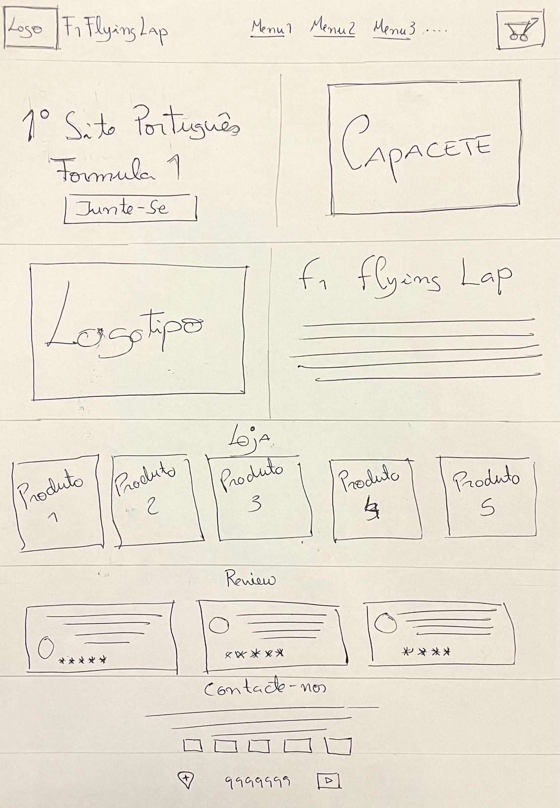
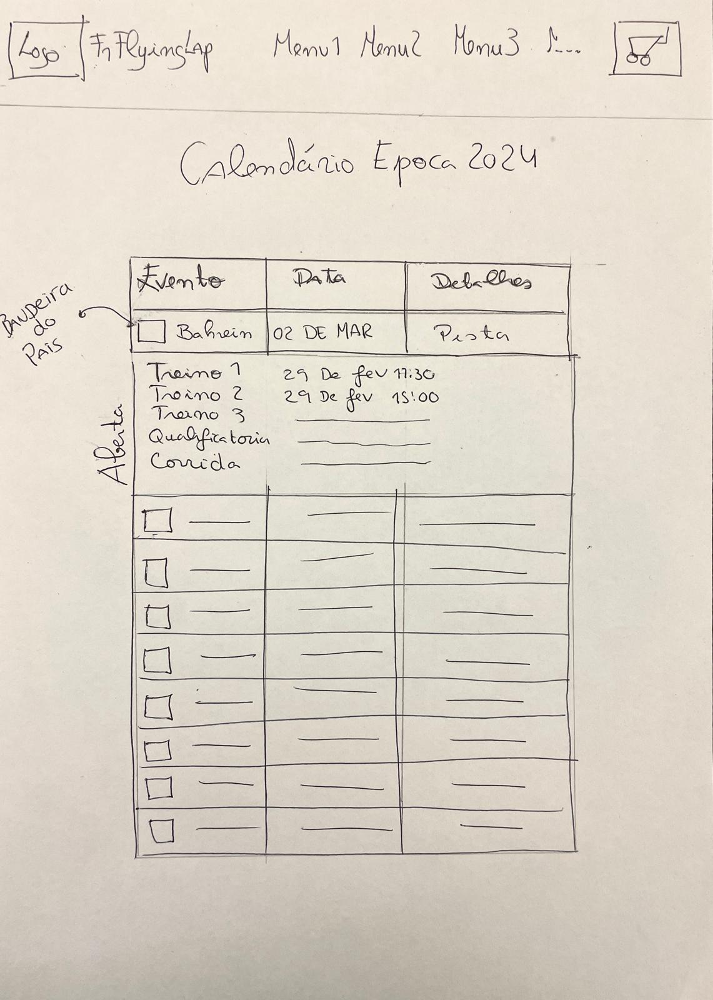
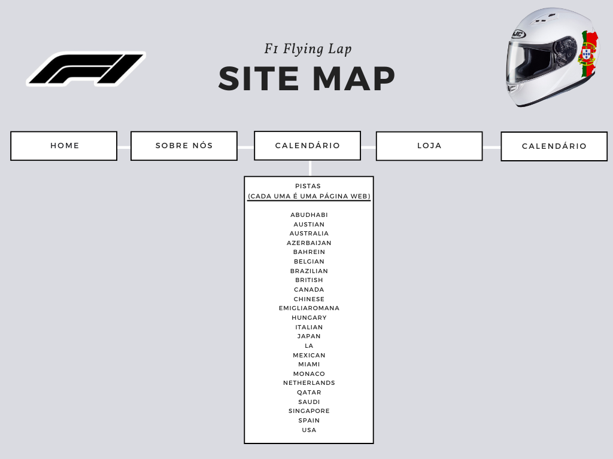

# **F1 Flying Lap Project**

## **Interface do Utilizador**

_Nesta página, irei descrever como organizei as informações no site. Além disso, demonstrarei através de desenhos de planejamento como foi pensada a sua estrutura e a organização das páginas._ 

### **Interface e Funções**

#### **Desenhos**

_Desenhos de Planejamento do Site_

| | |
|:---:|:---:|
|  |  |  
_Descrição: Desenhos iniciais do planejamento do site._ | _Descrição: Detalhes do layout da interface._

#### **Mapa do Site**

Mapa de Ligações do Website Flying Lap F1

  
_Descrição: Estrutura do mapa de ligações do site._

---

## **Produto**

### **Produto: 1º Website Unicamente em Português sobre F1**

#### **Capturas de Tela do Produto**
|  |  |
|:---:|:---:|
|  |  |

---

### **3.1 Instalação**
- A instalação foi realizada com base numa organização no GitHub e com o uso da plataforma Netlify.

### **3.2 Dicas de Funcionamento**
- Atenção: Os botões de "Carrinho" ou "Comprar Agora" são apenas demonstrações, pois o projeto refere-se apenas ao Frontend.

### **3.3 Organização da Interface**
- A interface gráfica está organizada com 6 menus: 
  - **Home**
  - **Sobre Nós**
  - **História**
  - **Calendário**
  - **Loja**
  - **Contactos**

- O calendário permite o acesso às páginas de cada uma das pistas de cada corrida.

### **3.4 Formulário**
- O formulário de contacto valida apenas se o campo "email" contiver um formato de email válido.
- Exemplo: Se for preenchido com um ponto, não será aceito.

### **3.5 Detalhes de Implementação**

#### **HTML**

| Requisito             | Exemplo de Uso                                                                                                                                         |
|:----------------------:|:------------------------------------------------------------------------------------------------------------------------------------------------------:|
| **Table**              | [Exemplo de tabela](https://github.com/PedroVenda27/INTERNET_TECNOLOGYS/blob/main/inf23tig01/TP_TI_23-24-main/Website_inf23tig01/calendario.html#L45) |
| **List**               | [Exemplo de lista](https://github.com/PedroVenda27/INTERNET_TECNOLOGYS/blob/main/inf23tig01/TP_TI_23-24-main/Website_inf23tig01/index.html#L23-L30)    |
| **Highlight**          | [Exemplo de destaque](https://github.com/PedroVenda27/INTERNET_TECNOLOGYS/blob/main/inf23tig01/TP_TI_23-24-main/Website_inf23tig01/index.html#L58)       |
| **Image**              | [Exemplo de imagem](https://github.com/PedroVenda27/INTERNET_TECNOLOGYS/blob/main/inf23tig01/TP_TI_23-24-main/Website_inf23tig01/index.html#L11)         |
| **Figure**             | [Exemplo de figura](https://github.com/PedroVenda27/INTERNET_TECNOLOGYS/blob/main/inf23tig01/TP_TI_23-24-main/Website_inf23tig01/index.html#L47-L49)     |
| **Figure Caption**     | [Exemplo de legenda](https://github.com/PedroVenda27/INTERNET_TECNOLOGYS/blob/main/inf23tig01/TP_TI_23-24-main/Website_inf23tig01/index.html#L93-L96)    |
| **Internal Link**      | [Exemplo de link interno](https://github.com/PedroVenda27/INTERNET_TECNOLOGYS/blob/main/inf23tig01/TP_TI_23-24-main/Website_inf23tig01/index.html#L23-L30) |
| **External Link**      | [Exemplo de link externo](https://github.com/PedroVenda27/INTERNET_TECNOLOGYS/blob/main/inf23tig01/TP_TI_23-24-main/Website_inf23tig01/index.html#L223-L228) |
| **Form**               | [Exemplo de formulário](https://github.com/PedroVenda27/INTERNET_TECNOLOGYS/blob/main/inf23tig01/TP_TI_23-24-main/Website_inf23tig01/contactos.html#L62)   |

#### **CSS**

| Requisito                 | Exemplo de Uso                                                                                                                                          |
|:--------------------------:|:-------------------------------------------------------------------------------------------------------------------------------------------------------:|
| **Type Selector**          | [Exemplo de selector de tipo](https://github.com/PedroVenda27/INTERNET_TECNOLOGYS/blob/main/inf23tig01/TP_TI_23-24-main/Website_inf23tig01/style.css#L24C1-L27C2) |
| **Id Selector**            | [Exemplo de selector de id](https://github.com/PedroVenda27/INTERNET_TECNOLOGYS/blob/main/inf23tig01/TP_TI_23-24-main/Website_inf23tig01/style.css#L95-L101) |
| **Class Selector**         | [Exemplo de selector de classe](https://github.com/PedroVenda27/INTERNET_TECNOLOGYS/blob/main/inf23tig01/TP_TI_23-24-main/Website_inf23tig01/style.css#L29-L41) |
| **Pseudo-class Selector**  | [Exemplo de pseudo-classe](https://github.com/PedroVenda27/INTERNET_TECNOLOGYS/blob/main/inf23tig01/TP_TI_23-24-main/Website_inf23tig01/style.css#L69-L71)   |
| **Attribute Selector**     | [Exemplo de selector de atributo](https://github.com/PedroVenda27/INTERNET_TECNOLOGYS/blob/main/inf23tig01/TP_TI_23-24-main/Website_inf23tig01/style.css#L928-L938) |
| **Pseudo-element Selector**| [Exemplo de pseudo-elemento](https://github.com/PedroVenda27/INTERNET_TECNOLOGYS/blob/main/inf23tig01/TP_TI_23-24-main/Website_inf23tig01/style.css#L940-L943)   |
| **Text Style**             | [Exemplo de estilo de texto](https://github.com/PedroVenda27/INTERNET_TECNOLOGYS/blob/main/inf23tig01/TP_TI_23-24-main/Website_inf23tig01/style.css#L277-L282)    |
| **Font Style**             | [Exemplo de estilo de fonte](https://github.com/PedroVenda27/INTERNET_TECNOLOGYS/blob/main/inf23tig01/TP_TI_23-24-main/Website_inf23tig01/style.css#L5)           |
| **Background Style**       | [Exemplo de estilo de fundo](https://github.com/PedroVenda27/INTERNET_TECNOLOGYS/blob/main/inf23tig01/TP_TI_23-24-main/Website_inf23tig01/style.css#L24-L25)       |
| **Float/Position Style**   | [Exemplo de estilo de flutuação/posição](https://github.com/PedroVenda27/INTERNET_TECNOLOGYS/blob/main/inf23tig01/TP_TI_23-24-main/Website_inf23tig01/style.css#L873-L878) |
| **List Style**             | [Exemplo de estilo de lista](https://github.com/PedroVenda27/INTERNET_TECNOLOGYS/blob/main/inf23tig01/TP_TI_23-24-main/Website_inf23tig01/style.css#L6C1-L6C22)    |
| **Box Element Style**      | [Exemplo de estilo de box](https://github.com/PedroVenda27/INTERNET_TECNOLOGYS/blob/main/inf23tig01/TP_TI_23-24-main/Website_inf23tig01/style.css#L894-L900)       |
| **Table Style**            | [Exemplo de estilo de tabela](https://github.com/PedroVenda27/INTERNET_TECNOLOGYS/blob/main/inf23tig01/TP_TI_23-24-main/Website_inf23tig01/style.css#L693-L700)     |
| **Responsivity Style**     | [Exemplo de estilo responsivo](https://github.com/PedroVenda27/INTERNET_TECNOLOGYS/blob/main/inf23tig01/TP_TI_23-24-main/Website_inf23tig01/style.css#L527-L545)   |

#### **XML & XSD**

| Requisito     | Exemplo de Uso                                                                                                       |
|:-------------:|:--------------------------------------------------------------------------------------------------------------------:|
| **XML File**  | [Calendário F1 XML](https://github.com/PedroVenda27/INTERNET_TECNOLOGYS/blob/main/inf23tig01/TP_TI_23-24-main/Website_inf23tig01/CalendarioF1.xml) |
| **XSD File**  | [Calendário F1 XSD](https://github.com/PedroVenda27/INTERNET_TECNOLOGYS/blob/main/inf23tig01/TP_TI_23-24-main/Website_inf23tig01/CalendarioF1.xsd) |

---

# **Grupo Tecnologias da Internet**

## **Descrição**

Constituição do Grupo para o Trabalho Prático Tecnologias da Internet 2023/24

---

## **Group 01**

- **Pedro Miguel Soares Venda**  
  [@PedroVenda27](https://github.com/PedroVenda27)
